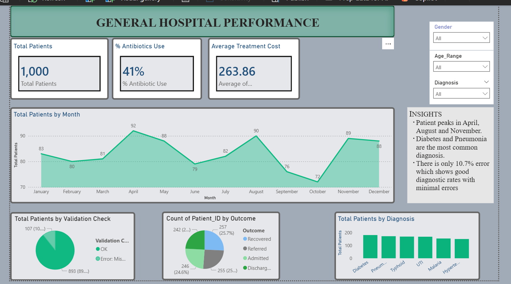

[Download Dataset](hospital_patient_dataset.csv.xlsx)

Got it — you want this to represent a **combined Excel + Power BI project**, not just Power BI. Here’s a cleaner, more professional and “GitHub-ready” version that reflects both tools and sounds more cohesive and human:

---

# GENERAL HOSPITAL PERFORMANCE ANALYSIS

## 📌 OVERVIEW
This project analyzes hospital patient data using both **Excel and Power BI** to uncover key insights around patient distribution, treatment patterns, and prescription practices.

The workflow began in **Excel for data cleaning and preliminary analysis**, and was extended into **Power BI for interactive dashboard development and deeper visualization**.

The goal was to transform raw hospital data into a clear, insight-driven dashboard that supports better healthcare decision-making.

---

## OBJECTIVES

* Understand patient distribution across different diagnoses
* Analyze trends in patient visits over time
* Evaluate treatment costs and patterns
* Assess antibiotic usage and prescription accuracy
* Identify key healthcare trends for decision support

---

## TOOLS AND SKILLS USED

* **Microsoft Excel**

  * Data cleaning and preprocessing
  * Basic analysis and validation checks
  * Initial exploratory insights

* **Power BI**

  * Interactive dashboard design
  * DAX measures and calculated columns
  * Advanced data visualization

* **General Skills**

  * Data cleaning & transformation
  * Data analysis & storytelling
  * Dashboard design & UX thinking

---

## KEY FEATURES

###  Excel Analysis

* Data cleaning and validation checks
* Exploratory analysis of patient records
* Early insights into diagnosis patterns and treatment costs

###  Power BI Dashboard

* **KPI Cards**

  * Total Patients
  * Antibiotic Usage (%)
  * Average Treatment Cost

* **Monthly Trend Analysis**

  * Tracks patient visit patterns over time

* **Diagnosis Breakdown**

  * Highlights most common conditions

* **Outcome Analysis**

  * Shows recovery, admission, and other outcomes

* **Prescription Validation**

  * Checks correctness of antibiotic prescriptions

* **Interactive Filters (Slicers)**

  * Gender, Age Group, Diagnosis

---

## KEY INSIGHTS

* Patient visits peak in **April, August, and November**, suggesting possibility of seasonal trends
* **Diabetes and Pneumonia** are the most frequent diagnoses
* Antibiotic usage rate is **41%**, mainly linked to infection-related cases
* Prescription validation shows a relatively low error rate (**10.7%**), indicating strong diagnostic consistency

---

##  LEARNING PROCESS

* How to combine **Excel and Power BI in a real analytics workflow**
* The importance of **clean data before visualization**
* How DAX can enhance analytical depth in dashboards
* How to present data in a way that tells a **clear, structured story**
* How Excel and Power BI complement each other in real-world analysis

---

##  CONCLUSION

This project demonstrates how healthcare data can be transformed into meaningful insights using a combination of **Excel for preprocessing** and **Power BI for visualization**.

It highlights the importance of combining technical analysis with storytelling to support better, data-driven healthcare decisions.

---

## 📸 DASHBOARD PREVIEW

------

---

